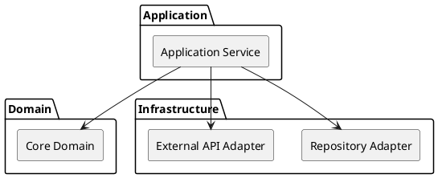

# Diagram Guide

Generate diagrams only when they make architecture easier to understand. Prefer a small set of high-value diagrams over a large decorative set.

## Diagram selection

### System context diagram
Use when the system interacts with multiple users, devices, services, or external systems. Show the system boundary and external relationships.

### Overall architecture/component diagram
Use for nearly every non-trivial system. Show major layers/subsystems/components and dependency direction.

### Module dependency diagram
Use when dependency structure is important or when reviewing an existing codebase for coupling/cycles.

### Data-flow / pipeline diagram
Use when data moves through multiple processing stages, queues, buffers, transformations, services, or storage layers.

### Sequence diagram
Use for architecturally important cross-module interactions, startup flows, request/response flows, protocol flows, recovery flows, or asynchronous handoffs.

Do not create sequence diagrams for simple single-module logic.

### State diagram
Use only when explicit states and transitions determine system behavior, such as connection/session/device/workflow modes.

Do not add a state diagram simply because code contains `switch` statements.

### Deployment diagram
Use only when process/node/container/device placement materially affects architecture. It is not a default chapter or diagram.

### Thread/task/concurrency diagram
Use when execution contexts, queues, synchronization, or ownership are essential to understanding the design. Integrate it into architecture/module sections rather than forcing a standalone chapter.

## Greenfield diagram rules

For requirements-first projects:

- Draw proposed architecture as a design, not as an implemented fact.
- Start from system context and responsibilities before drawing classes or functions.
- Label optional/alternative components clearly when a decision is unresolved.
- Use diagrams to validate requirement coverage and dependency direction.

## Brownfield diagram rules

For existing projects:

- Prefer actual observed relationships.
- Avoid showing a dependency only because two modules have similar names.
- When simplifying a large codebase, state that the diagram is a logical/architectural view rather than an exhaustive call graph.

## PlantUML preference

When PlantUML is available, prefer text-based `.puml` sources so diagrams can be versioned and regenerated offline.

Keep diagram source alongside generated image/output when practical.

Example component diagram:

## Mermaid fallback

If PlantUML is unavailable but Mermaid is supported by the target workflow, Mermaid is acceptable for simple architecture and flow diagrams.

## Text fallback

If no rendering tool is available, produce a readable text/ASCII diagram and preserve a structured description that can later be converted to PlantUML.

## Consistency checks

Before finalizing diagrams:

- every named module should match document terminology;
- dependency arrows should have an intentional direction;
- interfaces shown in diagrams should not contradict text;
- proposed and existing elements should not be visually indistinguishable when both are shown;
- avoid excessive detail that makes the diagram unreadable;
- do not expose internal source-level detail unless needed for architecture review.
